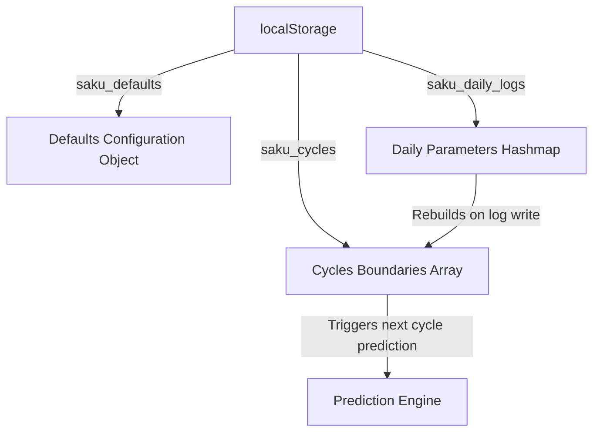
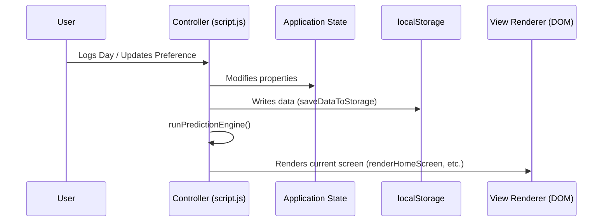

# Saku Period Tracker Architecture

## 1. Project Overview
Saku is a modern, responsive, offline-first Single-Page Application (SPA) designed to help users track their menstrual cycles, flow intensity, mood, pain levels, symptoms, and physiological metrics (weight and temperature) with absolute privacy. Saku is built strictly with vanilla HTML5, CSS3, and modern ECMAScript 6 JavaScript, utilizing no frameworks, compilers, or external library dependencies.

---

## 2. System Architecture & Folder Structure

```
/ (Project Root)
├── index.html         # Application viewport layout and modal overlays
├── style.css          # Core CSS stylesheet, theme definitions, and fluid grid layout
├── script.js          # Controller layer, state management, prediction engine, calendar, and statistics calculations
├── architecture.md    # System architecture specification
└── workflow.md        # Feature tracking roadmap and testing checklist
```

### Responsibility Matrix:
- **`index.html`**: Defines the semantic structures of the five key viewport screens (Home, Calendar, History, Stats, Settings), multi-step logging forms, modal overlays, inline SVGs, and keyboard attributes (`aria-` labels, `tabindex`).
- **`style.css`**: Manages styling utilizing CSS Variables (for easy theme modification), glassmorphism styles, fluid grids, and touch target scaling.
- **`script.js`**: Implements state management, core logging systems, local storage persistence, predictive calculations, dynamic list generation, DOM updates, and custom alert systems.

---

## 3. Data Architecture & Local Storage Schema

All application data is persisted client-side within the browser's `localStorage` sandbox.



### JSON Schema Specifications:

#### 1. Defaults Key (`saku_defaults`):
Stores the user's menstrual default parameters.
```json
{
  "cycleLength": 28,
  "periodLength": 5,
  "enableNotifications": false
}
```

#### 2. Cycles Key (`saku_cycles`):
An array of objects representing completed, distinct menstrual cycles, sorted in ascending order.
```json
[
  {
    "id": "1687884572000",
    "startDate": "2026-06-01",
    "endDate": "2026-06-05"
  }
]
```

#### 3. Daily Logs Key (`saku_daily_logs`):
A key-value hashmap where the key is the local date string (`YYYY-MM-DD`). This holds symptoms, vitals, mood, pain levels, and qualitative journal entries for any individual day.
```json
{
  "2026-06-27": {
    "date": "2026-06-27",
    "isPeriodDay": true,
    "flow": "medium",
    "mood": "happy",
    "pain": 3,
    "symptoms": ["cramps", "fatigue"],
    "weight": 58.4,
    "temp": 36.65,
    "notes": "Feeling a little bit tired but doing great overall."
  }
}
```

---

## 4. Core Prediction Engine & Algorithmic Processing

Saku contains a self-correcting predictive algorithm that dynamically adapts to a user's logged data.

### 1. Variables Definition:
Let $N$ be the total number of tracked cycles in `state.cycles`.
- Let $C_{user}$ be the default cycle length set in settings (Default 28).
- Let $P_{user}$ be the default period duration set in settings (Default 5).
- Let $C_{avg}$ be the calculated average cycle length.
- Let $P_{avg}$ be the calculated average period duration.

### 2. Period Duration Calculation ($P_{avg}$):
$$P_{avg} = \frac{1}{N} \sum_{i=1}^{N} (\text{endDate}_i - \text{startDate}_i + 1)$$

### 3. Cycle Length Calculation ($C_{avg}$):
Saku evaluates the interval between successive cycle starts. It employs an **outlier filter** to prevent manual logging errors or missed cycles (e.g. gaps caused by pregnancy or missed tracking months) from skewing calculations:
$$C_{gap\_i} = \text{startDate}_{i+1} - \text{startDate}_i$$
$$C_{avg} = \text{Average of } C_{gap\_i} \quad \text{for all } i \text{ where } 15 \le C_{gap\_i} \le 45$$

If $N < 2$, calculations default to $C_{user}$ and $P_{user}$.

### 4. Predictive Projections:
Let $D_{last}$ be the start date of the most recent cycle in history.
- **Predicted Next Period Start**: $D_{last} + C_{avg}$
- **Predicted Next Period End**: $(\text{Predicted Start}) + P_{avg} - 1$
- **Predicted Ovulation Day**: $(\text{Predicted Start}) - 14$
- **Predicted Fertile Window**: From $(\text{Predicted Ovulation} - 5)$ to $(\text{Predicted Ovulation} + 1)$ (total of 7 days).

---

## 5. View Routing & State Management

Saku operates as a Single-Page Application (SPA) driven by a single-directional rendering pipeline.



### State Properties:
- `defaults`: Typical cycle settings and preferences.
- `cycles`: Boundaries list.
- `dailyLogs`: Detailed parameters keyed by date.
- `selectedDate`: Current target day.
- `currentYear` & `currentMonth`: Navigation pointers for calendar.
- `activeTab`: tracks currently focused viewport.

---

## 6. Rendering & Interaction Subsystems

### Bottom Navigation:
Tabs trigger a global `switchTab(targetId)` event that:
1. Removes the `.active` class from previous elements and hides inactive views.
2. Displays the target `<section>` element via standard CSS display properties.
3. Fires the specific screen-render subroutine (e.g., `renderCalendar()`, `renderHomeScreen()`).

### Monthly Calendar Logic:
The calendar renders dynamically by determining the weekday placement of day 1 of the given month, drawing preceding dates as grayed-out pads, rendering active days of the month, mapping highlights based on prediction/logged states, and handling clicks by updating selected elements.

### Statistics Subsystem:
Reads arrays from memory to compute:
- Averages (Cycle, Period, Longest, Shortest).
- Log Streaks (consecutive cycles tracked within a 40-day interval).
- Frequency Distributions: Displays bar charts representing symptom occurrence frequency.

---

## 7. Accessibility, Security & Quality Specifications

### Privacy & Offline-First Design:
- **No Network I/O**: Saku does not connect to external servers or send analytical telemetry.
- **Data Portability**: Users retain full possession of their medical logs. An option to wipe all history cleanly is accessible in settings.

### Accessibility:
- **Keyboard Access**: Focus outlines (`:focus`) are enhanced with glowing borders. Interactive items are mapped using semantic layout elements or `tabindex`.
- **Contrast**: Rose elements pair against high-contrast charcoal texts (`#2b2d42`) to guarantee WCAG AA visibility.
- **Touch Targets**: Bottom buttons, chips, and calendars utilize touch padding exceeding the 48px tactile standard.
